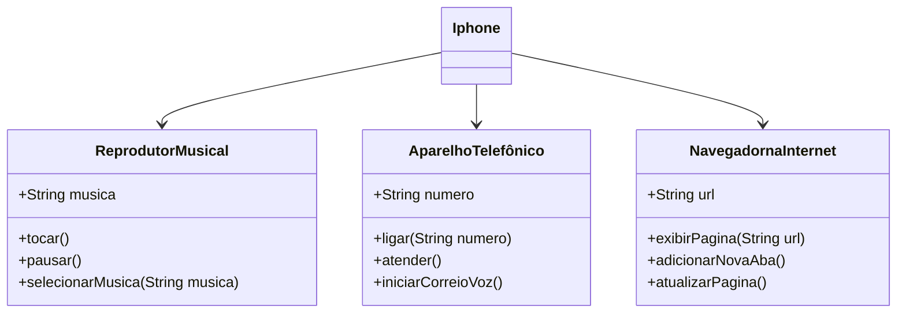

```mermaid
classDiagram
    Iphone-->ReprodutorMusical
    ReprodutorMusical:+String musica
    ReprodutorMusical:+tocar()
    ReprodutorMusical:+pausar()
    ReprodutorMusical:+selecionarMusica(String musica)

    Iphone-->AparelhoTelefônico
    AparelhoTelefônico:+String numero
    AparelhoTelefônico:+ligar(String numero)
    AparelhoTelefônico:+atender()
    AparelhoTelefônico:+iniciarCorreioVoz()

    Iphone-->NavegadornaInternet
    NavegadornaInternet:+String url
    NavegadornaInternet:+exibirPagina(String url)
    NavegadornaInternet:+adicionarNovaAba()
    NavegadornaInternet:+atualizarPagina()

```